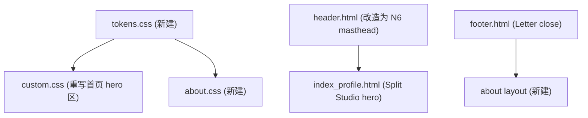

# 博客首页与 About 页风格重构方案

## 现状分析

当前首页（`layouts/partials/index_profile.html` + `assets/css/extended/custom.css`）是一套完整的「冷白工作台」设计系统：
- 冷白纸 `oklch(98.5% 0.004 190)` + 点阵场 + 玻璃导航胶囊 + 深色工作台卡片
- 圆角 (8/14/22px)、毛玻璃、浮动光晕、hover scale、animate.css 入场动画
- 约 600 行 hero CSS + 2000 行其他页面 CSS

设计目标（来自 [design.md](design.md) + Slow Pour 参考图）：
- 暖纸底 `oklch(94.5% 0.018 78)` + terracotta accent `oklch(52% 0.125 48)`
- N6 Newspaper masthead（期号 · 居中站名 · 日期线 · 发丝线）
- Split Studio hero：左侧大 italic editorial statement + 右侧最新文章 proof card
- 直角 radius: 0、发丝线 1px、mono labels、motion-cut
- 字体：Instrument Serif (display) / Newsreader (body) / IBM Plex Mono (labels)

## 重构策略

增量覆盖而非整套替换 PaperMod 主题。保留 `custom.css` 中每日新闻、文章、归档等已稳定的样式（约 2000 行），只替换首页 hero 区域（约 600 行）和新增 about 页。

## 文件变更清单

### 1. 新建 tokens.css — 设计系统 token 导出
- 路径：`assets/css/extended/tokens.css`
- 内容：直接从 design.md Tokens 段提取 `:root` 变量
- 引入 Google Fonts：Instrument Serif, Newsreader, IBM Plex Mono（在 `extend_head.html` 中加载）

### 2. 重写 extend_head.html — 字体加载
- 路径：`layouts/partials/extend_head.html`
- 移除 animate.css CDN（首页不再需要 animate.css 入场动画；其他页面的 animate.css 引用暂保留，待后续页面迁移后统一清理）
- 新增 Google Fonts preconnect + stylesheet（Instrument Serif, Newsreader, IBM Plex Mono, Noto Serif SC）

### 3. 重写 header.html — N6 Newspaper Masthead
- 路径：`layouts/partials/header.html`
- 结构变更：
  - 左侧：期号 label（VOL. I · NO. xx，mono, tracking-label）
  - 中间：站名「Jian の Blog」（display serif, italic）
  - 右侧：当前日期（Tuesday, the 2nd of June，mono）
  - 底部：发丝线 `border-bottom: var(--rule-hair) solid var(--color-rule)`
- 非首页保持简化 masthead（仅站名 + 导航链接）
- 移除玻璃导航胶囊、圆角、backdrop-filter

### 4. 重写 index_profile.html — Split Studio Hero
- 路径：`layouts/partials/index_profile.html`
- 新结构：
  - **Masthead 之下**：发丝线分隔
  - **左列 (60%)**：
    - 上方 label：`A PERSONAL DISPATCH`（mono, terracotta, tracking-label）
    - 主 statement：大 italic serif display text（如 `记录技术、生活与持续的实验。`）— 使用 `--text-display` / `--lh-tight`
    - 下方 body text：2-3 行描述（Newsreader body）
    - 两个 CTA：「浏览文章 →」（深墨填充直角按钮）+「关于我」（发丝线描边按钮）
  - **右列 (40%)**：最新文章 Proof Card
    - 顶部：期号 label + 分类 tag（mono）
    - 标题（serif, snug line-height）
    - 元数据 dl：日期 / 分类 / 阅读时间 / 字数（mono labels + body values）
    - 底部可选：3 行摘要
- 移除：点阵场、浮动光晕、animate.css class、搜索表单、快链 chips、深色工作台卡
- 搜索入口移至 header 导航或 footer（非首屏内容）

### 5. 重写 custom.css 首页区域 — Editorial Token 系统
- 路径：`assets/css/extended/custom.css`
- **删除/替换区域**：L1-L837（`:root` 旧 token + `.header--home` + `.blog-hero*` 全部）
- **保留区域**：L838+ 每日新闻/文章/归档样式原封不动
- **新增内容**：
  - `.masthead-*` N6 masthead 样式（发丝线、mono labels、居中站名）
  - `.dispatch-hero` Split Studio hero 布局（CSS Grid 60/40 split）
  - `.dispatch-hero__statement` display text 样式
  - `.dispatch-hero__proof` proof card 样式（直角边框、发丝线、mono metadata）
  - `.dispatch-cta--primary / --secondary` CTA 按钮（直角、深墨/发丝线）
  - 全部使用 `tokens.css` 变量名
  - 响应式：320/375/414/768 断点验证

### 6. 重写 footer.html — Letter Close
- 路径：`layouts/partials/footer.html`
- 简化为 Ft6 Letter close 或 Ft2 Inline rule 风格：
  - 发丝线分隔
  - 一行居中文本：`© 2026 Jian の Blog · Powered by Hugo`
  - 不要四列 sitemap / social icon grid

### 7. 新建 About 页面布局
- 路径：`layouts/_default/about.html`（或 `layouts/about/list.html`）
- 结构遵循 Long Document 变体：
  - N6 masthead（复用 header partial）
  - 无营销式 hero，直接进入内容
  - 左侧可选目录边注（复用 daily-doc 的 sticky sidebar 模式）
  - 正文：Newsreader body, 58-68ch 宽度, 宽松段落节奏
  - 标题用 upright serif（不做假斜体）
- 路径：`assets/css/extended/about.css`（或合并到 custom.css 新增段落）

### 8. 更新 hugo.yaml 配置
- `defaultTheme: light`（editorial 暖纸以浅色为主基调，暗色作为可选）
- 可能新增 params 用于 masthead 期号/期数

## 不做什么（Out of Scope）

- 不改动 `daily/`, `gallery/`, `shrimp-diary/`, `posts/` 列表页和文章详情页的现有样式
- 不改动 chat-widget, message-wall, where 等功能模块
- 不引入新的构建工具或 CSS 框架
- 不触碰 PaperMod 主题目录 (`themes/PaperMod/`) 内的任何文件
- 暗色模式暂不作为首要目标（先确保浅色期刊基调正确，暗色跟进）

## 风险点

- **animate.css 依赖**：其他页面（每日新闻、归档等）仍在使用 `animate__animated animate__fadeInUp` 等 class。首页重构移除后需确认其他页面不受影响 — 策略是 `extend_head.html` 暂保留 animate.css 引入，仅首页模板不再使用其 class。
- **旧 hero CSS 残留**：custom.css 前 837 行被替换后，如有其他模板引用 `.blog-hero__*` class 需一并清理。
- **字体加载性能**：新增 4 个 Google Fonts family，需做 `font-display: swap` + preconnect 优化。
- **中文 display 排版**：design.md 要求中文标题不做假斜体，需在 CSS 中对 `:lang(zh)` 或含中文的 selector 设置 `font-style: normal`。

## 实现备注

- 现象 / 缺陷：旧首页使用 `.blog-hero*`、点阵背景、玻璃导航和首页 Three.js 标题脚本，和 `design.md` 的暖纸期刊式系统不一致；About 页声明了 `layout: "about"`，但缺少对应布局。
- 正确期望行为：首页应由 N6 masthead、Split Studio dispatch statement 和最新文章 proof card 组成；About 页应使用 Long Document 阅读版式；默认主题应为浅色暖纸。
- 本次修复方式：新增 `tokens.css` 与 `zz-editorial.css`，重写首页/header/footer partial，新增 `layouts/_default/about.html` 与 `about.css`，并更新 `hugo.yaml` 的 masthead 参数。为避免误伤每日新闻、归档和文章页，旧 `.blog-hero*` CSS 暂保留但首页模板不再引用；`animate.css` 继续加载以支持仍使用 animate class 的非首页页面。
- 现象 / 缺陷：首页首屏原标语和说明文案不符合最新表达，且缺少中/英双语查看入口；同时原说明「AI 工程师 | 记录技术、生活与思考」不应作为首屏可见说明继续展示。
- 正确期望行为：首页首屏默认显示中文标语「把问题拆开，/把系统建起，/把生活继续」，可通过同一行右侧 `ZH / EN` 控件切换到英文；切换范围仅限首屏 UI 文案，不翻译文章标题、分类名和摘要正文，不改变文章路由、内容目录、RSS 或 SEO 结构。
- 本次修复方式：在 `hugo.yaml` 的 `params.masthead.dispatch` 中新增中英文文案组；在首页首屏输出双语文本并用轻量脚本按 `data-dispatch-lang-panel` 切换显示，语言选择写入 `localStorage`；在 `zz-editorial.css` 中补充发丝线直角语言控件、display italic 标题和移动端布局保护。
